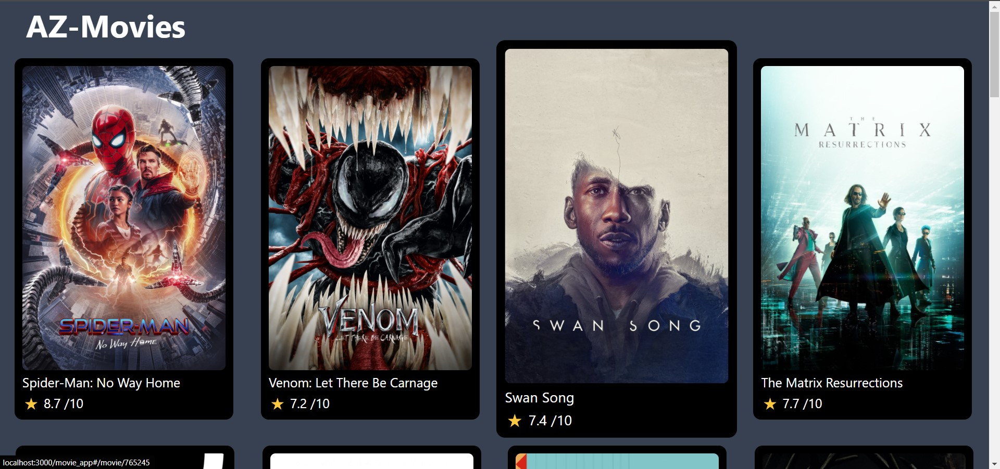
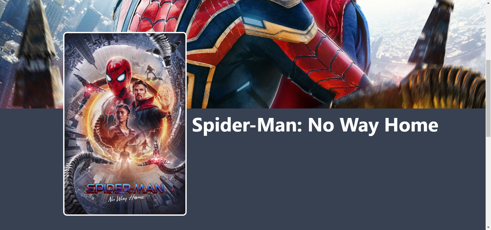
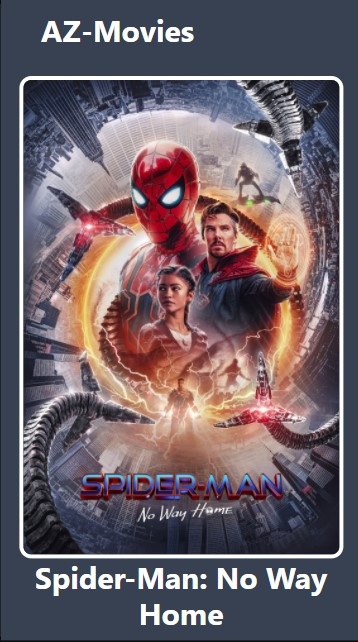

# Movie Web App

#### Live Link - [Click Me](https://harshsinghs1058.github.io/movie_app/#/)

### Tech Stacks Used

- React.js
- Tailwindcss @3.0.0

### Tools Used

- axios
- react-router-dom
- TMDB Api

### Demo Video

- Coming Soon

### How to Run

##### - Install Packages

`yarn`

##### - Api key

- create .env file
- add your TMDB api key in this file with name of REACT_APP_API_KEY

##### - Start App

`yarn start`

### Screenshots

- Home Page

  

- Movie Details Page
  

- 404 Route Not Found
  

- Movie Page (Mobile)

- Full Home Page
  

- Full Movie Page
  
